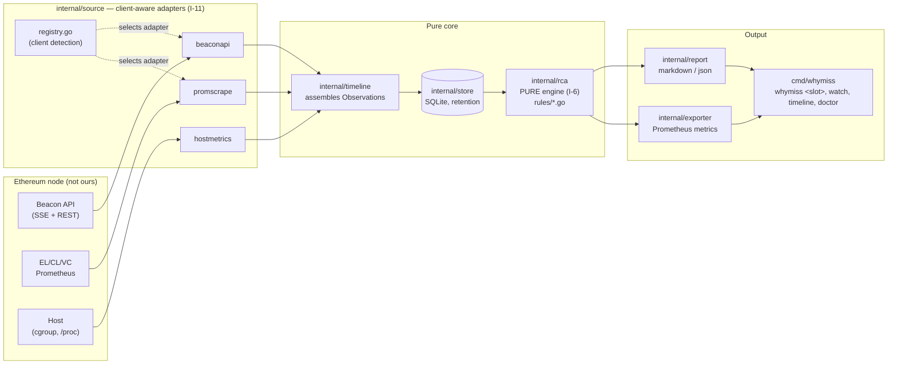
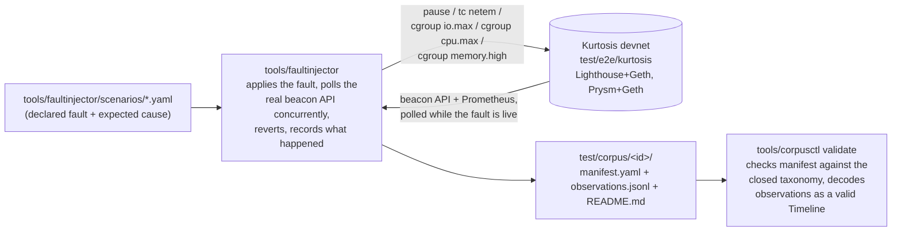

# Architecture

whymiss is a read-only sidecar. It watches one Ethereum node, and when a
validator misses or is late on a duty, it produces a forensic post-mortem
naming the responsible layer with timestamped evidence — see
[BUILD_PROMPT.md](BUILD_PROMPT.md) §1 for the full mission statement.

This document describes the runtime pipeline as designed across all phases,
and the offline harness that generates the test data the pipeline is
validated against. It reflects the target shape from
[BUILD_PROMPT.md](BUILD_PROMPT.md) §4's canonical repository structure; the
"status" column in each section below says what exists today.

## 1. Runtime pipeline

| Stage | Package | Status | Purpose |
|---|---|---|---|
| Collect | `internal/source/beaconapi` | Phase 2 | SSE stream (`head`, `block`, `chain_reorg`, `attestation`) + REST polling for duties and inclusion |
| Collect | `internal/source/promscrape` | Phase 2 | Scrapes EL/CL/VC Prometheus, normalises Lighthouse/Prysm metric names into `domain.MetricSample` |
| Collect | `internal/source/hostmetrics` | Phase 2 | Disk iowait, CPU steal, memory pressure, clock drift — degrades gracefully when unavailable |
| Collect | `internal/source/registry.go` | Phase 2 | The one place client type is detected and an adapter selected (I-11: no other file may know a client's name) |
| Assemble | `internal/timeline` | Phase 2 | Turns raw Observations + MetricSamples into a `domain.Timeline`, deterministically ordered |
| Persist | `internal/store` | Phase 2 | SQLite, versioned migrations, retention by both time and bytes (I-12) |
| Decide | `internal/rca` | Phase 3 | Pure function: `Timeline -> Verdict`. No I/O, no clock, no randomness, no goroutines (I-6). One rule per file under `rules/`, evaluated in the fixed precedence order in [causes.md](causes.md) §6 |
| Present | `internal/report` | Phase 3 | Renders a `Verdict` as markdown (human) or JSON (machine) |
| Present | `internal/exporter` | Phase 4 | Exposes verdict outcomes as Prometheus metrics for the operator's existing Grafana |
| Present | `cmd/whymiss` | Phase 1 stub, Phase 3 (`whymiss <slot>`) + Phase 4 (`doctor`, polish) | The CLI surface: `whymiss <slot>`, `watch`, `timeline <slot>`, `doctor` |

`internal/app` (Phase 2+) is the composition root — the only package that
wires a concrete `source` adapter, `store`, and `rca` engine together. Every
other package depends on interfaces it defines itself, not on `app`.

## 2. Why `internal/rca` is isolated

`internal/domain` and `internal/rca` import nothing outside the Go standard
library — enforced by `make check` (`.golangci.yml` `depguard` rules), not
just convention. Two consequences fall out of that boundary:

- **`internal/rca` is testable without a live node.** A `domain.Timeline`
  built from a corpus scenario's `observations.jsonl` (§3 below) produces the
  exact same `domain.Verdict` a real collector run would, because the engine
  cannot tell the difference — it never touches a clock, a socket, or a file.
- **A verdict is always traceable.** `internal/rca` is a decision tree of
  named rules (`docs/causes.md` §6), not a model. `unknown.no_rule_matched`
  exists specifically so an unmatched case is visible and fixable, rather
  than silently misclassified (I-8).

## 3. Offline harness: how the corpus is made

The runtime pipeline above doesn't run against production traffic during
development — Phase 1's thesis is "build the test data before the product"
(BUILD_PROMPT.md §9). `test/corpus/` is generated by a separate, one-shot
harness that never ships in the `whymiss` binary:

Every value written to `observations.jsonl` is something `faultinjector`
actually measured against a live devnet during that run — never
hand-written (BUILD_PROMPT.md §8). When a fault mechanism turns out not to
move the needle on this devnet's workload (documented cases: cgroup `io.max`
disk throttling and moderate `cgroup_cpu` throttling both left duty timing
unaffected at every severity tried — see `CHANGELOG.md`), that is recorded
as a negative finding and the scenario is not kept in the corpus with an
unsupported label.

`internal/rca`'s test suite (Phase 3) replays every `test/corpus/*` scenario
through the real engine and asserts the verdict matches `manifest.yaml`'s
`expect` block — this is what makes the corpus "the moat, the test suite,
and the grant evidence simultaneously" (BUILD_PROMPT.md §9).

## 4. Cross-cutting boundaries

- **I-1 / I-3 / I-4** — `internal/source` only ever reads from the node; no
  mutating calls, no root, no outbound egress beyond the node's own APIs the
  operator configured. Checked in CI (`make check`'s egress boundary test).
- **I-9 clock discipline** — `internal/clock` measures NTP offset and
  degrades to a typed error, never a fabricated reading, when every
  configured server fails. `local.host.clock_drift` (R-011) fires *before*
  any other timing-based rule and suppresses them, because a wrong clock
  invalidates every duration measurement downstream of it.
- **I-11 client isolation** — the only files allowed to know a client's
  name are `internal/source/registry.go` (detection),
  `internal/source/peers.go` (adapter selection), and the adapter packages
  themselves (`internal/source/promscrape`, mainly). Everything past
  `internal/source` — `internal/app` included — operates on
  `ConsensusClient` values and `domain.Observation`/`domain.MetricSample`,
  none of which carry a client name as a string literal. `make
  check.isolation` enforces this by grepping `internal` and `cmd` for
  client names outside `internal/source/` on every CI run, not just
  documenting the intent.
- **I-12 bounded resources** — `internal/store`'s retention is bounded by
  both wall-clock age and total bytes, so the sidecar stays safe on the
  reference minimum hardware (a Raspberry Pi 5).

## 5. Adding a third client

BUILD_PROMPT.md §10.3's Phase 2 DoD requires this to be demonstrated, not
asserted — so this walks the actual change a third consensus client (Teku,
say) would need, file by file, against the code as it exists today.

1. **`internal/source/registry.go`** — add `ConsensusTeku` alongside
   `ConsensusLighthouse`/`ConsensusPrysm`, and a `strings.HasPrefix(versionString,
   "Teku")` case in `DetectConsensusClient`.
2. **`internal/source/promscrape/peers.go`** — add `SampleTekuPeerCount`,
   reading whatever metric name Teku's own `/metrics` endpoint actually
   uses for its peer count (captured from a real node first —
   `SampleLighthousePeerCount`/`SamplePrysmPeerCount`'s own doc comments
   record the real, verified metric name each existing client uses,
   `libp2p_peers` vs. label-summed `connected_libp2p_peers{agent="..."}` —
   these two already differ completely from each other, which is the
   proof this isn't a coincidence that happens to generalise).
3. **`internal/source/peers.go`** — add a `case ConsensusTeku:` arm to
   `SamplePeerCount` calling the new function.

That's it. **Every line above is under `internal/source/`.**
`internal/app/watch.go` — the composition root, the only caller of
`SamplePeerCount` — is unchanged: it already dispatches through
`ConsensusClient` values it got from `DetectConsensusClient`, never a
client-named symbol (see §4's I-11 bullet). `internal/domain`,
`internal/timeline`, `internal/store`, `internal/rca` (Phase 3), and
`cmd/whymiss` don't reference consensus clients at all and have nothing to
change. `make check.isolation` — which already runs in `make ci` — is what
would catch it immediately if a future change violated this by, say,
special-casing Teku inside `internal/app` instead of adding the dispatch
arm in step 3.

The same shape applies to a third *execution* client for
`internal/source/promscrape`'s EL side (`engine.go`): a new EL client's
Engine API metric names get their own `engineMetricNames`-equivalent map
and a case in whatever function replaces today's geth-only
`SampleEngineCalls`, once a second EL client is in scope (BUILD_PROMPT.md
§3 locks the initial scope to geth alone, so there is no second EL client
to point at yet — this paragraph names the pattern, not a change made).
